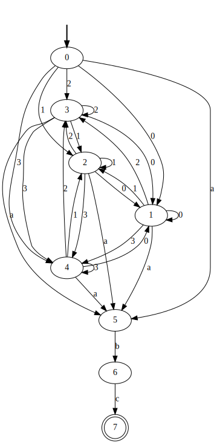

# Compiladores

Orientaciones para correr el programa que va desde una expresión regular a un Autómata Finito No Determinista (NFA), y que a su vez, se transforma a un  Autómata Finito Determinista (DFA)

## 0. Pre-requisitos
* Poder correr programas de Python3.
* Clonar este repositorio.

## 1. Instalar las dependencias
`pip3 install -r requirements.txt`

## 2. Introducir la Expresión Regular 
* En el archivo RE.txt
* En la primera línea va la expresión regular, ejemplo: `(0|1|2|3)*.a.b.c`
* De la segunda en adelante, los símbolos presentes en el alfabeto, ejemplo:
  - 0
  - 1
  - 2
  - 3
  - a
  - b
  - c  

## 3. Ejecutar en la consola
`python3 tarea1.py`

## 4. NFA.
* El programa genera el NFA en formato .svg llamado: `output_NFA.dot.svg` 
* Se genera algo similar a lo siguiente:

## 5. DFA.
* El programa genera el DFA en formato .svg llamado: `output_DFA.dot.svg` 
* Se genera algo similar a lo siguiente:

## 6. Eliminar proyecto.
Para dejar de usar el proyecto, solamente se rquiere eliminar el repositorio.