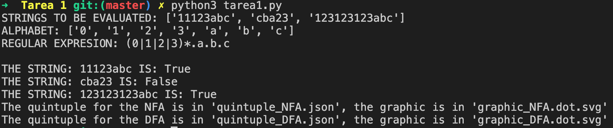

# Compiladores Tarea 1
## REGEX -> NFA -> DFA

Orientaciones para correr el programa que va desde una expresión regular a un Autómata Finito No Determinista (NFA), y que a su vez, se transforma a un Autómata Finito Determinista (DFA)

## 0. Pre-requisitos
* Poder correr programas de Python3.
* Clonar este repositorio.
* Moverse a la carpeta de "Tarea 1" ` cd Tarea\ 1/`

## 1. Instalar las dependencias
`pip3 install -r requirements.txt`

## 2. Introducir la Expresión Regular y Cadenas a Evaluar
* En el archivo RE.txt
* En la primera línea poner el número de cadenas a evaluar, ejemplo: (3)
  - `3`
* En las siguientes (3) líneas poner las cadenas a evaluar, ejemplo:
  - `11123abc`
  - `cba23`
  - `123123123abc`
* Definición de símbolos:
  - '.' Concatenación
  - '|' Unión
  - '*' Estrella Kleene
  - '+' Uno o más elementos 
  - '?' 0 o 1 elemento
* En la primera línea después de las cadenas va la expresión regular, ejemplo: `(0|1|2|3)*.a.b.c`
* De la segunda en adelante, los símbolos presentes en el alfabeto, ejemplo:
  - 0
  - 1
  - 2
  - 3
  - a
  - b
  - c  
* NOTA: la expresión regular (RE) ingresada anteriormente, debe contener '.' para decir que es una concatenación, por lo que no se puede usar para decir que es un símbolo del alfabeto de la RE. Así mismo, no se puede decir que '+' es un símbolo del alfabeto, puesto que indica que es uno o más elementos. En conclusión no puedes definir un símbolo del alfabeto que esté en la definición de símbolos de la RE. El símbolo 'e' representa a epsilon o nulo

## 3. Ejecutar en la consola
`python3 tarea1.py`

## 4. NFA.
* El programa genera el NFA en formato .svg llamado: `graphic_NFA.dot.svg` 
* Se genera algo similar a lo siguiente:

## 5. DFA.
* El programa genera el DFA en formato .svg llamado: `graphic_DFA.dot.svg` 
* Se genera algo similar a lo siguiente:

## 6. Validación de Cadenas
* Para validar si las cadenas son correctas dentro de la expresión regular, revisar la consola, ahí se muestran si son o no validas, ejemplo:

## 7. Eliminar proyecto.
Para dejar de usar el proyecto, solamente se rquiere eliminar el repositorio.
